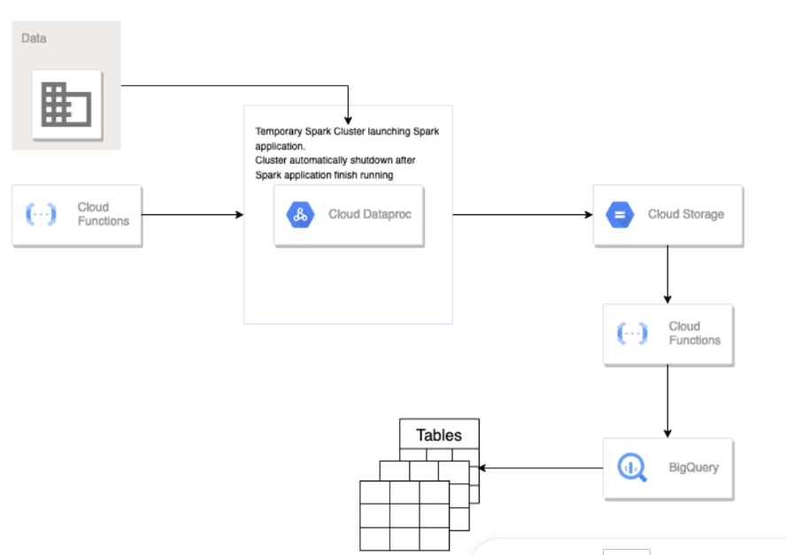
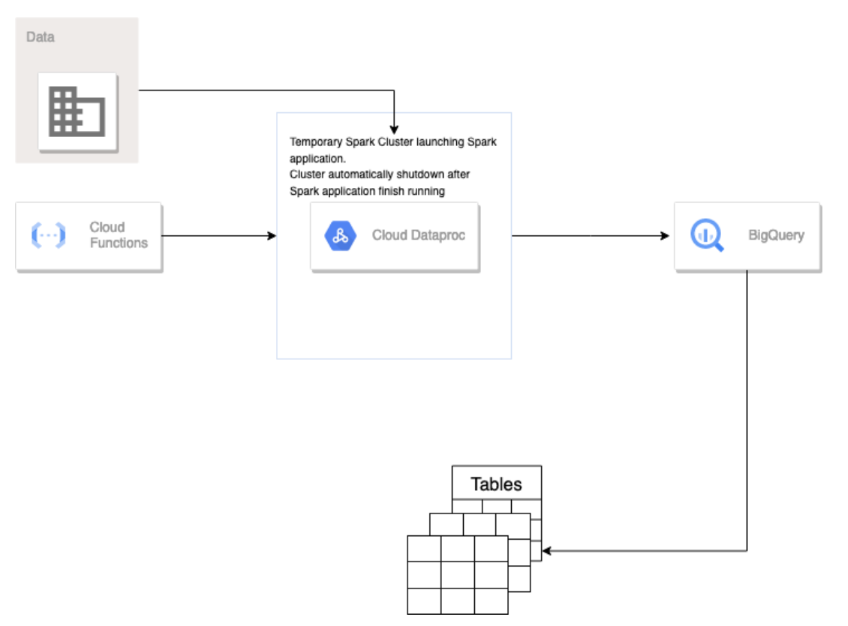

# Mini Projet

Nom du projet GCP : My Fist Project

Ce projet propose deux architectures système différentes pour répondre à des besoins spécifiques.

## Architecture 1 

### Description
Les données sont transformés en plusieurs datasets et ensuite intégrés dans des tables BigQuery.

#### Composants Principaux
- **main.py** script de preprocessing
- **mini-projet-bucket** le bucket des input , il contient notament le script de preprocessing.
- **bucket-ouput** le bucket des ouput

## Fonctionnement

### Recupération et traitement de la donnée

Pour declencher la pipeline il suffit d'uploader un fichier dans le bucket `mini-projet-bucket`.

La fonction `function-1` trigerred par l'ajout/supression  d'un fichier dans ce bucket va creer un cluster temporaire :

Ce cluster est chargé d'executer un job pyspark (`main.py`).

A noter qu'il s'arretera juste apres l'execution du script .

La fonction `function-1` se termine par l'envoi d'un message indiquant la reussite du processus dans un Topic PubSub

### Chargement des tables BigQuery

Une fois que les 5 fichiers csv destinés à repondre aux questions sont déposés dans notre bucket de sortie `bucket-ouput` , et le message envoyé au Topic.

Une fonction `bucket-to-bigquery` trigerred par l'envoi d'un message sur le Topic1 se charge de l'import de ces fichiers dans des tables BigQuery.

## Architecture 2 

### Description
Les données sont d'abord intégré dans Biquery en entier puis à l'aide de requetes SQL ,repondre les questions clients.

#### Composants Principaux
- **main.py** script de preprocessing
- **bucket-achi-2** le bucket des input , il contient notament le script de preprocessing.
- **bucket-ouput** le bucket des ouput

### Fonctionnement
Pour declencher la pipeline il suffit d'uploader un fichier dans le bucket `bucket-achi-2`

